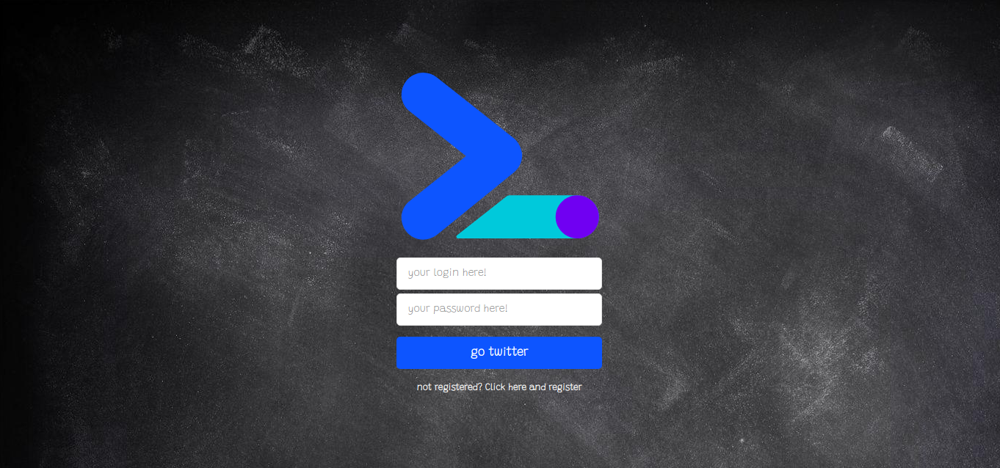
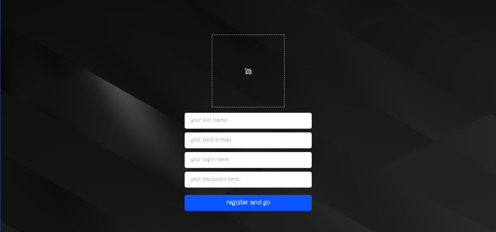
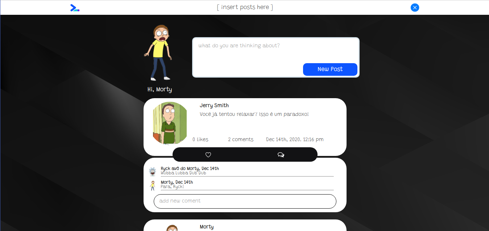

# Twitta-Dev

Project in development

##### Technologies used: ReactJS and NodeJS.








## Build project

##### Run back-end
```
backend/

Install node modules:
npm install

Start
yarn dev
```

##### Run front-end
```
frontend/

Install node modules:
npm install

Start
yarn start
```
