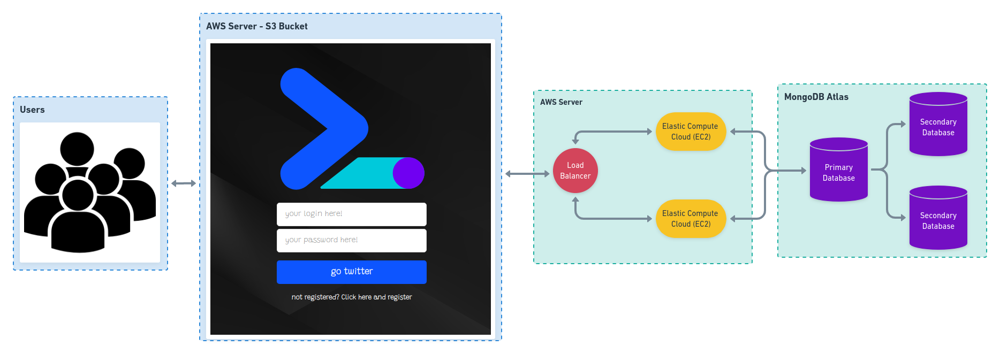

# Twitta-Dev

#### What is application?

This application is a system in which users can express their feelings and / or thoughts through posts, as well as, like and comment on other posts. This application was developed as one of the assessments of the distributed systems discipline, from the computer engineering course at UFRB.

To use start using the application users must access the registration page, and then start the fun!

#### How to use:

The application can be accessed through the 

To access the application you must follow two steps:
- Open this [link](https://lb-twitta-dev-1499725272.us-east-1.elb.amazonaws.com:3333/), to access the application backend and accept the security terms, necessary because there is no security certificate;

- Open this [link](http://twitta-dev-frontend.s3-website-us-east-1.amazonaws.com/) to access the application, and then enjoy!


##### Technologies used: 

- ReactJS;
- NodeJS;
- Amazon E2C;
- Amazon S3 Bucket;
- MongoDB Atlas.

## Project Design

The system design is defined in the figure below:



- Users will have access to the application that is hosted on the Amazon Bucket S3 service, which provides object storage through a web service interface.

- User interactions in the application (registration, login, posts, likes and comments) will be sent to the load balancer service. Elastic Load Balancing automatically distributes incoming application traffic between Amazon EC2 instances.

- In the E2C instances, the application backend is stored, connecting to the MongoDB Atlas database.

- MongoDG Atlas is responsible for creating and maintaining the database, creating the database on Amazon AWS servers. This service is also responsible for creating replicas of the database.

The architecture presented, guarantees that the system will have high availability, that is, through the load balancer, it guarantees that even if one of the servers (backend) fails, the application will still be available and users will be able to continue using it. As well as ensuring consistency, since the database is distributed and replicated, ensuring that, even if one of the databases is offline or unavailable, user data can be accessed normally.


## Build project

##### Run back-end
```
backend/

Install node modules:
npm install

Start
yarn dev
```

##### Run front-end
```
frontend/

Install node modules:
npm install

Start
yarn start
```
